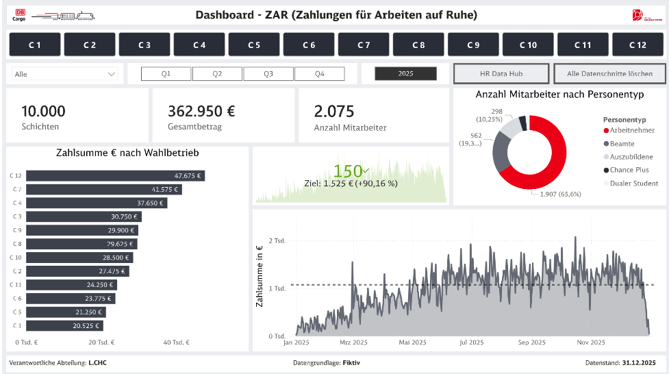
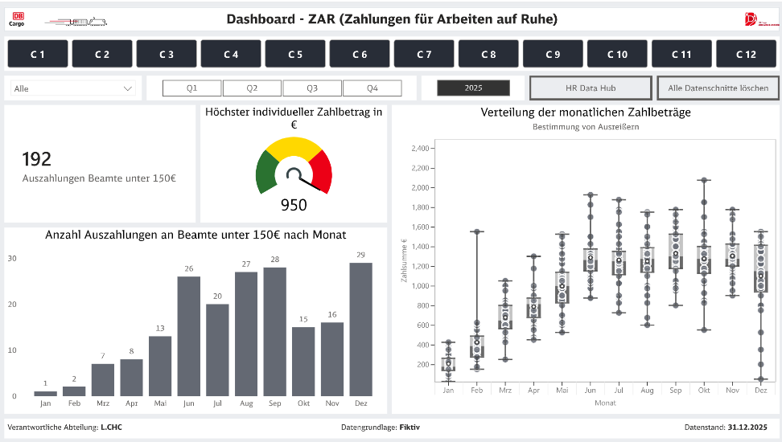

# 🚆 Cargo – HR Controlling & Zahlungsanalyse Dashboard (Power BI)

Power BI Dashboard, entwickelt im HR- / Finance-Controlling-Kontext, um fragmentierte Excel-Reports abzulösen und eine strukturierte, KPI-basierte Entscheidungsgrundlage zu schaffen.

---

## 📊 Dashboard-Vorschau

### Seite 1 – Executive Overview

  

### Seite 2 – Analyse & Drilldown

  

---

## 🎯 Ausgangssituation

Das Reporting basierte zuvor auf manueller Excel-Konsolidierung und E-Mail-Abstimmungen.  
Die Folgen:

- Verzögerte Reporting-Zyklen  
- Hoher Abstimmungsaufwand  
- Begrenzte Transparenz  
- Keine durchgängige Drilldown-Möglichkeit  

Ziel war der Aufbau einer skalierbaren, strukturierten Reporting-Lösung mit klar definierten Kennzahlen.

---

## 💡 Lösungsansatz

- Entwicklung eines strukturierten KPI-Frameworks (Ist, Budget, Abweichung)
- Trennung von Management-Übersicht und Detailanalyse
- Drilldown bis auf Transaktionsebene
- Historische Vergleichslogik
- Vorbereitung für weitere Prozessdigitalisierung (z. B. standardisierte Datenerfassung via Power Apps)

---

## 🧩 Datenmodell

Das Dashboard basiert auf einem strukturierten Datenmodell mit klarer Trennung von Fakt- und Dimensionstabellen.

Fokus:

- Konsistente Datenlogik  
- Saubere KPI-Definition  
- Wartbare Modellstruktur  
- Skalierbarkeit für zukünftige Erweiterungen  

---

## 🚀 Wirkung

- Reduzierung manueller Excel-Konsolidierung  
- Erhöhte Transparenz im HR-Controlling  
- Drilldown von Kennzahlen auf Einzeltransaktionen  
- Aufbau einer stabilen Reporting-Basis für weitere Digitalisierungsinitiativen  

---

## 🛠 Technologien

Power BI  
DAX  
Power Query  
Excel  
Datenmodellierung  

---

## 👤 Meine Rolle

- Konzeption der Dashboard-Architektur  
- Definition und Strukturierung der KPIs  
- Analyse und Validierung von Altdaten  
- Übersetzung fachlicher Anforderungen in Datenlogik  
- Aufbau einer skalierbaren Reporting-Struktur  

---

## 📎 Präsentation

Dashboard als .pdf:

`2026_02_11_Präsentation.pdf`
